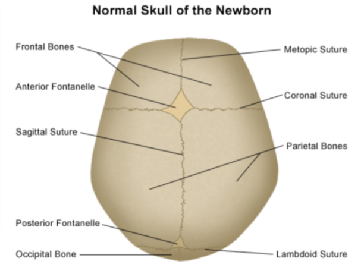
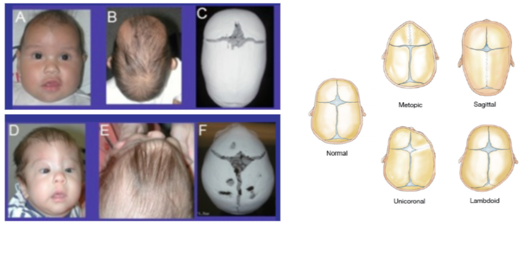
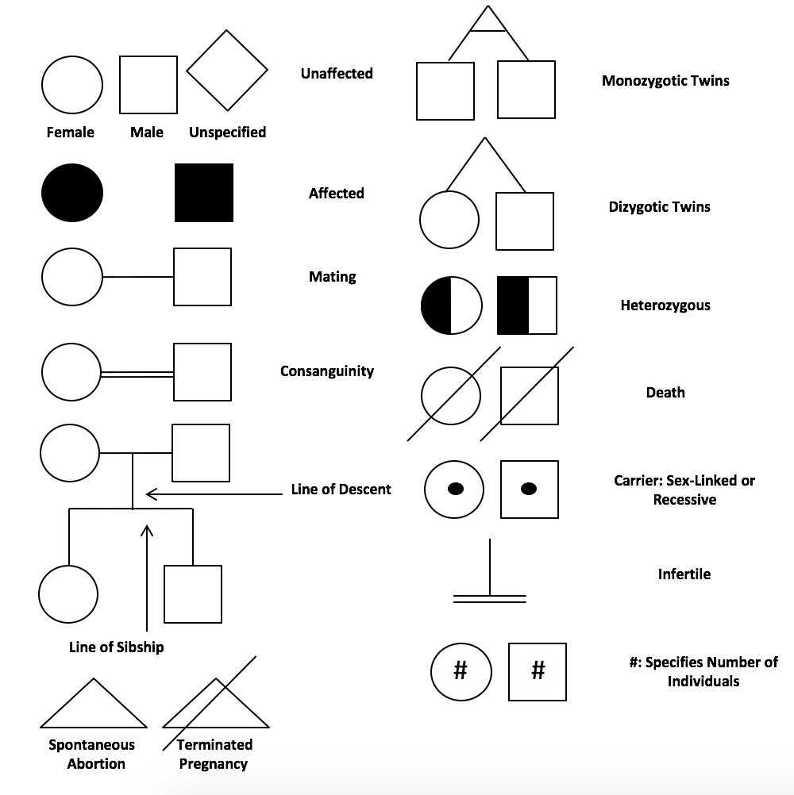
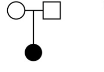
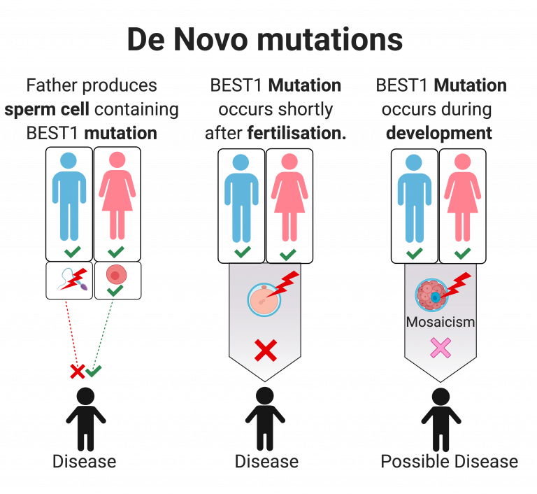
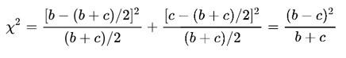

<script> function buildQuiz(myq, qc){ // variable to store the HTML output const output = []; // for each question... myq.forEach( (currentQuestion, questionNumber) => { // variable to store the list of possible answers const answers = []; // and for each available answer... for(letter in currentQuestion.answers){ // ...add an HTML radio button answers.push( ` ${letter} : ${currentQuestion.answers[letter]}
` ); } // add this question and its answers to the output output.push( `
${currentQuestion.question}
${answers.join('')}

` ); } ); // finally combine our output list into one string of HTML and put it on the page qc.innerHTML = output.join(''); } function showResults(myq, qc, rc){ // gather answer containers from our quiz const answerContainers = qc.querySelectorAll('.answers'); // keep track of user's answers let numCorrect = 0; // for each question... myq.forEach( (currentQuestion, questionNumber) => { // find selected answer const answerContainer = answerContainers[questionNumber]; const selector = `input[name=question${questionNumber}]:checked`; const userAnswer = (answerContainer.querySelector(selector) || {}).value; // if answer is correct if(userAnswer === currentQuestion.correctAnswer){ // add to the number of correct answers numCorrect++; // color the answers green answerContainers[questionNumber].style.color = 'lightgreen'; } // if answer is wrong or blank else{ // color the answers red answerContainers[questionNumber].style.color = 'red'; } }); // show number of correct answers out of total rc.innerHTML = `${numCorrect} out of ${myq.length}`; } </script>
# Plink Step by Step
- What is plink?
    - [Plink Website](https://zzz.bwh.harvard.edu/plink/)
    - PLINK is a free, open-source whole genome association analysis toolset, designed to perform a range of basic, 
    large-scale analyses in a computationally efficient manner.

## Outline
- About this dataset    
- Convert vcf file to plink format for our processing workflow
- Update the family based information for plink
- Filter based on percentage genotyped 
- Filter based on monomorphic SNPs
- Remove hemizygous SNPs
- Get Mendelian Errors and filter these out.
- Filter based on linkage disequilibrium (LD)
- Calculate Identity by Descent (IBD)
- Calculate TDT (transmission disequilibrium test), a type of FBAT (family based assocation test)


--- 


# About this dataset

- We will be analyzing two chromosomes from family based association study focusing on metopic craniosynostosis.
- We are analyzing two chromosomes due to the fact that running the full data could be very computationally intensive and
this data is not fully released to the public yet.
- chr 21 and chr 22 will be used as they are on the smaller side. 

## What is craniosynostosis?

- Craniosynostosis is the premature suture during skull formation
- Suture: A type of joint between the bones of the skull where the bones are held tightly together by fibrous tissue
- In particular, we will focus on the midline suture abnormalities.
- Requires intensive surgery at birth. 
- Occurs in every 1/2000-1/2500 births.






## WGS data was collected from trios with an affected child and unaffected parents. We now have a vcf file as discussed in the data reduction.

Just to be clear lets look at a pedigree of the type of trios we are interested in, and also just do a quick review of pedigrees. 




Here would be a female child example of this trio: 



---


### <font color='red'> Start Group Exercise 1: (25 mins) </font>
 
- At every step take a second with your group to decipher each command before running.

---
# Lets do some initial setup
- first we will load the plink module
- next we will set a sample or in this case the chromosome we want to analyze
- in addition we will set an outpath for the analysis and make that directory


```
mkdir /share/workshop/gwas_workshop/${USER}
mkdir /share/workshop/gwas_workshop/${USER}/plink
cd /share/workshop/gwas_workshop/${USER}/plink

# this will take say omitting directories and that is ok
cp /share/workshop/plink_template/* .
mkdir 00-Fixed
ln -s /share/workshop/plink_template/00-Fixed/* 00-Fixed/
```


```
module load plink/1.90p
#sample=`sed "${SLURM_ARRAY_TASK_ID}q;d" chrom.txt`
sample='21'
outpath='01-Plink_fam_fix'
[[ -d ${outpath} ]] || mkdir ${outpath}
```

- also we will indicate where the chromosome based vcf files are located and create an `infile` based on the sample or chromosome number

```
infile="00-Fixed/chr${sample}.subset.vqsr.vcf"
```
---

# Generate the b file
- What does this command generate?
- `.bim`, `.fam`, `.log`, `.nosex`, `.bed`

```
call0="plink --vcf ${infile} --make-bed --out ${outpath}/all_${sample}"
echo $call0
eval $call0
```


## Lets take a look at the files generated

```
head ${outpath}/all_${sample}.bim
cat ${outpath}/all_${sample}.bim | wc -l
cat ${outpath}/all_${sample}.log
head ${outpath}/all_${sample}.nosex
```

- One particular file type of interest is the `.bim` file. This is text file with no header line, and one line per variant with the following six fields:

    1. Chromosome code (either an integer, or 'X'/'Y'/'XY'/'MT'; '0' indicates unknown) or name
    2. Variant identifier
    3. Position in morgans or centimorgans (safe to use dummy value of '0')
    4. Base-pair coordinate (1-based; limited to 231-2)
    5. Allele 1 (corresponding to clear bits in .bed; usually minor)
    6. Allele 2 (corresponding to set bits in .bed; usually major)


- What does the major and minor allele mean?
    - major allele: the most common allele for a given SNP
    - minor allele: the less common allele for a SNP. The MAF is therefore the minor allele frequencey. This measure can be used to get a rough idea of the variation of genotypes for a given SNP in a given population, in other words it tells you how common this SNP is.

```
head ${outpath}/all_${sample}.bed
```

## Question:

What can you say about the variant at position 10001930? What is the observed variant and what is the reference allele?


---

# Update the .fam file
- What is a .fam file and why do we care about it?
- [From plink documentation](https://www.cog-genomics.org/plink/1.9/formats#fam)
- A text file with no header line, and one line per sample with the following six fields:
    1. Family ID ('FID')
    2. Within-family ID ('IID'; cannot be '0')
    3. Within-family ID of father ('0' if father isn't in dataset)
    4. Within-family ID of mother ('0' if mother isn't in dataset)
    5. Sex code ('1' = male, '2' = female, '0' = unknown)
    6. Phenotype value ('1' = control, '2' = case, '-9'/'0'/non-numeric = missing data if case/control)

```
fam="8_fam.txt"
head ${fam}
```

```
call0="plink --bfile ${outpath}/all_${sample} --make-bed --fam ${fam} --out ${outpath}/all_${sample}_fam"
echo $call0
eval $call0
```


## Question:
Amongst your group:
- Explain the relationship of 5136-SB-1280 in the study. 
- Explain the significance of 5136-SB-0214 in the study.


<script> quizContainer1 = document.getElementById('quiz1'); resultsContainer1 = document.getElementById('results1'); submitButton1 = document.getElementById('submit1');
myQuestions1 = [ { question: "How many genes are in the counts table", answers: { a: "22", b: "55,359", c: "56,173,982", }, correctAnswer: "b" }, { question: "How many samples are in the counts table", answers: { a: "22", b: "55,359", c: "56,173,982", }, correctAnswer: "a" }, { question: "What is the total count across all genes for sample mouse_110_WT_C", answers: { a: "10,000", b: "2,854,489", c: "2,353,648" }, correctAnswer: "c" }, { question: "'Extra-credit' question: How many genes have a count of 0 in every sample?", answers: { a: "22,491", b: "32,868", c: "55,359" }, correctAnswer: "b" } ];

buildQuiz(myQuestions1, quizContainer1); submitButton1.addEventListener('click', function() {showResults(myQuestions1, quizContainer1, resultsContainer1);}); </script>


---


### <font color='red'> End Group Exercise 1, Break </font>

Discussing the answers to the above question. 5 minute break.

After returning from break we will work on the second half of this document after I give a brief description of the portions involved. 


---


### <font color='red'> Start Group Exercise 2: (25 mins) </font>

- At every step take a second with your group to decipher each command before running.


---


# Remove all variants not genotyped to 95%
- Subsequent analyses can be set to automatically exclude SNPs on the basis of missing genotype rate, with the --geno option: the default is to include all SNPS (i.e. --geno 1). 
- To include only SNPs with a 95% genotyping rate (5% missing) use

```
call1="plink --bfile ${outpath}/all_${sample}_fam --geno 0.05 --make-bed --out ${outpath}/clean-missing_${sample}"
echo $call1
eval $call1
```

```
cat ${outpath}/clean-missing_${sample}.bim | wc -l
```


## Question:

What was position of the 5th variant removed?

---


# Remove monomorphic SNPs
- [From Biostars](https://www.biostars.org/p/80014/#80017)
- "How would you differentiate between a sequencing error, one-off single mutation or transcription error, and a bona-fide SNP? SNPs are found across individuals in a population -- monomorphic loci represent one individual's nucleotide state and may be the result of errors across numerous levels. When you see a SNP in multiple individuals you can infer it is not from sequencing error or a mutation found in a single individual."

```
call2="plink --bfile ${outpath}/clean-missing_${sample} --maf 0.000000001 --make-bed --out ${outpath}/clean-missing-monos_${sample}"
echo $call2
eval $call2
```

```
cat ${outpath}/clean-missing-monos_${sample}.bim | wc -l
```


## Question:

What was the last variant removed?


---

# The following line will create a temporary variant identifier in the `.bim` file.    
```
cat ${outpath}/clean-missing-monos_${sample}.bim > ${outpath}/tempfile_${sample}.bim
awk '{print $1"\t"$4"\t"$3"\t"$4"\t"$5"\t"$6}' ${outpath}/tempfile_${sample}.bim > ${outpath}/clean-missing-monos_${sample}.bim
```

---


# Remove all SNPs with "*" as an alt allele (hemizygous snps)


```
grep "*" ${outpath}/clean-missing-monos_${sample}.bim | awk '{print $4}' > ${outpath}/allHemizgyous_${sample}.txt
call3="plink --bfile ${outpath}/clean-missing-monos_${sample} --exclude ${outpath}/allHemizgyous_${sample}.txt --allow-no-sex --make-bed --out ${outpath}/clean-basic-QC_${sample}"

echo $call3
eval $call3
```

```
head ${outpath}/allHemizgyous_${sample}.txt
cat ${outpath}/allHemizgyous_${sample}.txt | wc -l
cat ${outpath}/clean-missing-monos_${sample}.bim | grep "*" | head
head ${outpath}/clean-missing-monos_${sample}.bim
```


## Question:

How many hemizygous SNPs were there?


---


### <font color='red'> End Group Exercise 2, Break </font>

We will take a break here and come back in about 15 minutes after discussing the answers to the above questions. 

After returning from break we will work on the second half of this document after I give a brief description of the portions involved. 


---


### <font color='red'> Start Group Exercise 3 (35 mins): </font>


---

# Get Mendelian Errors
- it is very important to curate based on IBD before this step!!

- [From Wikipedia](https://en.wikipedia.org/wiki/Mendelian_error)
- "A Mendelian error in the genetic analysis of a species, describes an allele in an individual which could not have been received from either of its biological parents by Mendelian inheritance."
- "Possible explanations for Mendelian errors are genotyping errors, erroneous assignment of the individuals as relatives, or de novo mutations."
- What is a de novo mutation?



```
call4="plink --bfile ${outpath}/clean-basic-QC_${sample} --mendel --out ${outpath}/Mendelian_${sample}"
echo $call4
eval $call4
```

```
head ${outpath}/Mendelian_${sample}.mendel
head ${outpath}/clean-basic-QC_${sample}.bim
```

---


# Remove Mendelian Errors
```
call5="plink --bfile ${outpath}/clean-basic-QC_${sample} --exclude ${outpath}/Mendelian_${sample}.mendel --make-bed --out ${outpath}/cleanedME_${sample}"
echo $call5
eval $call5
```

```
head ${outpath}/cleanedME_${sample}.bim
```


---

# Filter on common variants for IBD
- This should be before the mendelian part

```
call6="plink --bfile ${outpath}/cleanedME_${sample} --maf 0.4 --make-bed --out ${outpath}/common_${sample}"

echo $call6
eval $call6
```

## Question:

What percentage of variants are removed at this step? Why do you think the nature of this percentage is fairly extreme?


---

# Calculate IBD

- What is IBD or identity by descent? This is the percentage relationship that you have with any given individual in the study.
- This is an important part to stop at and assess that each of our trios have the proper IBD.

```
call8="plink --bfile ${outpath}/common_${sample} --extract ${outpath}/common_${sample}.prune.in --make-bed --out ${outpath}/idb_${sample}"
echo $call8
eval $call8
```

---


# Calculate IBD within and across families (relatives check)
- What kind of file is produced here? `.genome` file
- [genome file from Plink](https://www.cog-genomics.org/plink/1.9/ibd)
- These calculations are not LD-aware. It is usually a good idea to perform some form of LD-based pruning before invoking them.
- https://www.biostars.org/p/188894/#189052

```
call9="plink --bfile ${outpath}/idb_${sample} --genome --rel-check --out ${outpath}/ibd-relcheck_${sample}"
echo $call9
eval $call9
```

- Lets check out the `.genome` file.
```
head ${outpath}/ibd-relcheck_${sample}.genome
```


## Question:


---

### <font color='red'> End Group Exercise 3, Break </font>

We will take a break here and come back in about 5 minutes after discussing the answers to the above questions. 

After returning from break we will work on the remainder of this document after I give a brief description of the portions involved. 

---

### <font color='red'> Start Group Exercise 4 (45 mins): </font>


---


# Calculate TDT across families
- [From Wikipedia](https://en.wikipedia.org/wiki/Transmission_disequilibrium_test)
- A specificity of the TDT is that it will detect genetic linkage only in the presence of genetic association. While genetic association can be caused by population structure, genetic linkage will not be affected, which makes the TDT robust to the presence of population structure.
- The derivation of the TDT shows that one should only use the heterozygous parents (total number b+c). The TDT tests whether the proportions b/(b+c) and c/(b+c) are compatible with probabilities (0.5, 0.5). This hypothesis can be tested using a binomial (asymptotically chi-square) test with one degree of freedom:




- it is important to notice the `--freq` command will be used here to produce a file with the MAF (minor allele frequency) 
for the variant in the population. 
- we will be using the information in this file later as it provides further helpful annotation. 

```
call11="plink --bfile ${outpath}/cleanedME_${sample} --tdt --freq --adjust --out ${outpath}/tdt_${sample}"
echo $call11
eval $call11
```


## Lets check out the `frq` file and the `tdt` file. We will want the information from both of these for later. 

```
head ${outpath}/tdt_${sample}.tdt
head ${outpath}/tdt_${sample}.tdt.adjusted
head ${outpath}/tdt_${sample}.frq
```


Now on your local computer command line or filezilla/winSCP:


- We took a look at the file via the CLI with the `head` command but we should start getting comfortable with 
transferring files to our local computer. The cluster is great but it doesnt present data quite as nicely as excel/google sheets. 
- use `pwd` to see where you are in your local computer. You may want to navigate somewhere like a workshop folder in, for example `~/Desktop/gwas_workshop`


# Lets convert our plink output at the point prior to TDT in order to annotate
- we do this here in prep for annotation which we will perform later
```
cd ${outpath}
module load plink/1.90p
plink --bfile cleanedME_${sample} --recode vcf --out cleanedME_${sample}_vcf
module load annovar
convert2annovar.pl -format vcf4old --withfreq cleanedME_${sample}_vcf.vcf > chr${sample}_anno.avinput
```


# Putting it all together in a script
- first we need to do a bit of setup 

```
cd /share/workshop/gwas_workshop/${USER}/plink
mkdir stderr
mkdir stdout
```


## Here is the script we will run take a look with your group and see if you have any questions or if there is anything unclear to the group.
- when you are comfortable move on to the `sbatch` command below where you will use this script on the cluster.

<pre class="prettyprint"><code class="language-sh" style="background-color:333333">
#!/bin/bash
#
#SBATCH --time=0-3  # days-hours
#SBATCH --job-name=plinkrun  # Job name
#SBATCH --array=1-2 # all chroms plus x and y
#SBATCH --nodes=1
#SBATCH --ntasks=24 # Number of cores
#SBATCH --mem=20000 # Memory pool for all cores (see also --mem-per-cpu)
#SBATCH --partition=production # Partition to submit to
#SBATCH --output=stdout/counts-ArrayJob_%A_%a.out # File to which STDOUT will be written
#SBATCH --error=stderr/counts-ArrayJob_%A_%a.err # File to which STDERR will be written
#SBATCH --mail-type=END # Type of email notification- BEGIN,END,FAIL,ALL
##SBATCH --mail-user=kgmitchell@ucdavis.edu # Email to which notifications will be sent (please change this if you want to uncomment this)


start=`date +%s`

hostname

module load plink/1.90p

sample=`sed "${SLURM_ARRAY_TASK_ID}q;d" chrom.txt`


cd /share/workshop/gwas_workshop/${USER}/plink

outpath='01-Plink_fam_fix'
[[ -d ${outpath} ]] || mkdir ${outpath}


infile="00-Fixed/chr${sample}.subset.vqsr.vcf"

# make b file
call0="plink --vcf ${infile} --make-bed --out ${outpath}/all_${sample}"
echo $call0
eval $call0


# set fam file and update our info
fam="8_fam.txt"
head ${fam}


call0="plink --bfile ${outpath}/all_${sample} --make-bed --fam ${fam} --out ${outpath}/all_${sample}_fam"
echo $call0
eval $call0


# filter based on genotyped amount
call1="plink --bfile ${outpath}/all_${sample}_fam --geno 0.05 --make-bed --out ${outpath}/clean-missing_${sample}"
echo $call1
eval $call1


# remove monomorphic SNPs
call2="plink --bfile ${outpath}/clean-missing_${sample} --maf 0.000000001 --make-bed --out ${outpath}/clean-missing-monos_${sample}"
echo $call2
eval $call2

# create a temp variant identifier
cat ${outpath}/clean-missing-monos_${sample}.bim > ${outpath}/tempfile_${sample}.bim
awk '{print $1"\t"$4"\t"$3"\t"$4"\t"$5"\t"$6}' ${outpath}/tempfile_${sample}.bim > ${outpath}/clean-missing-monos_${sample}.bim


# filter out hemizygous SNPs
grep "*" ${outpath}/clean-missing-monos_${sample}.bim | awk '{print $4}' > ${outpath}/allHemizgyous_${sample}.txt
call3="plink --bfile ${outpath}/clean-missing-monos_${sample} --exclude ${outpath}/allHemizgyous_${sample}.txt --freq --allow-no-sex --make-bed --out ${outpath}/clean-basic-QC_${sample}"

echo $call3
eval $call3


# get mendelian errors
call4="plink --bfile ${outpath}/clean-basic-QC_${sample} --mendel --out ${outpath}/Mendelian_${sample}"
echo $call4
eval $call4


# remove mendelian errors
call5="plink --bfile ${outpath}/clean-basic-QC_${sample} --exclude ${outpath}/Mendelian_${sample}.mendel --make-bed --out ${outpath}/cleanedME_${sample}"
echo $call5
eval $call5


# filter on common variants for IBD
call6="plink --bfile ${outpath}/cleanedME_${sample} --maf 0.005 --make-bed --out ${outpath}/common_${sample}"
echo $call6
eval $call6


# calculate IBD
call8="plink --bfile ${outpath}/common_${sample} --extract ${outpath}/common_${sample}.prune.in --make-bed --out ${outpath}/idb_${sample}"
echo $call8
eval $call8

# perform relative check
call9="plink --bfile ${outpath}/idb_${sample} --genome --rel-check --out ${outpath}/ibd-relcheck_${sample}"
echo $call9
eval $call9


# calculate tdt with p-value adjustment
# we will use the common file as that was the most filtered file prior to statistical tests
cd ${outpath}
module load plink/1.90p
plink --bfile cleanedME_${sample} --recode vccall11="plink --bfile ${outpath}/cleanedME_${sample} --tdt --freq --adjust --out ${outpath}/tdt_${sample}"
echo $call11
eval $call11f --out cleanedME_${sample}_vcf


module load annovar
convert2annovar.pl --format vcf4old --withfreq cleanedME_${sample}_vcf.vcf > chr${sample}_anno.avinput

</code></pre>


## Finally you can submit the jobs to the cluster
```
sbatch plink_final.slurm
```


## Check the status of your jobs. This should not take long. 
- wait until these are complete before you move on to the ` cat` command below.


```
squeue -u ${USER}
```


- Now that we have run both chromosome 21 and 22 we will combine the data and annotate it using wAnnovar
- the `.avinput` is a file format that is prepared for annotation with wAnnovar, since we have multiple of these lets put them together with the following simple command:

```
cat ${outpath}/*.avinput > master.avinput
```

---

### <font color='red'> End Group Exercise 4, Break </font>

We will take a break here and come back in about 15 minutes after discussing the answers to the above questions. 

After returning from break we will move onto the wAnnovar annotation with the data we have produced here. 

---


# TODO 
- what should params be for MAF????
- make sure ref and alt line up
- could add just explore tdt file with excel part
- clean up more for nik to work on tomoro
- fix allow-no-sex and clean up the fam file
- check my fam file with Anthony
