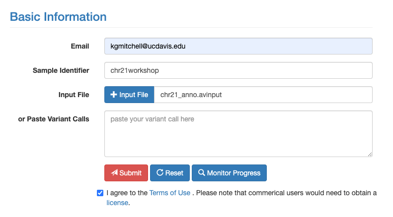
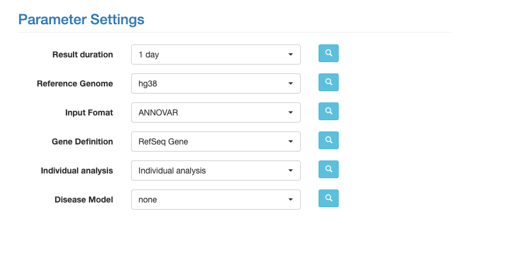
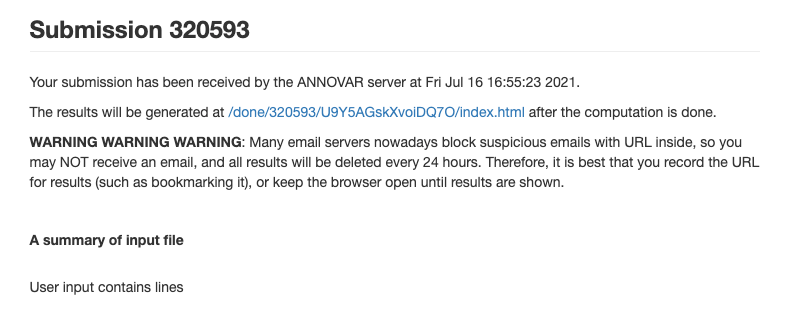
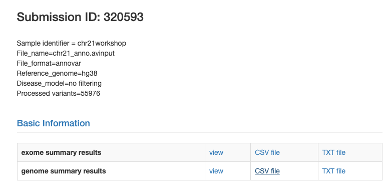

# wANNOVAR Annotation of Variants
- This assumes that Plink Step by Step has been completed
- [ANNOVAR Databases Used](https://annovar.openbioinformatics.org/en/latest/user-guide/filter/)
- ANNOVAR is a rapid, efficient tool to annotate functional consequences of genetic variation from high-throughput sequencing data. wANNOVAR provides easy and intuitive web-based access to the most popular functionalities of the ANNOVAR software


### <font color='red'> Start Group Exercise  (40 mins)</font>


## On your machine locally (or using filezilla/winscp)
- lets get the file ready for annotation with annovar
```
user="keithgmitchell"
scp ${user}@tadpole.genomecenter.ucdavis.edu:/share/workshop/gwas_workshop/${user}/plink/master.avinput .
```


## Go to this link: [wAnnovar](https://wannovar.wglab.org/)

Enter in the information below with your email, the sample identifier can be anything but use something helpful like chr21workshop.



Before you click submit, select the following parameters.



Now click submit. The result you see should be something like the following:



Finally, when the results are done you should get and email and you can click the link from the previous view and see the following:



Click the CSV file link for the genome summary results and take some time to go through with your group and check out the genome summary results view button to its left. 


## Question:
- What exonic variants exist in gene PSMG1? What are their positions and why do you suppose some have more annotation then the others?
What is the dbSNP id for the more annotated variants? What is the MAF of the population at this sight? Do you think it is a variant of interest?


## Now on the cluster:

- simple python script that makes the awkward plink output a clean CSV

```
cd /share/workshop/gwas_workshop/${USER}/plink
# Very simple script is just turning the values into a csv file for easier analysis with R uses the adjusted tdt file
python fix_tdt.py
```

- merge these csv files so we only have one to run

```
head -1 02-CleanedTDT/tdt_21.frq.csv > tdtfrq.csv
for i in `ls 02-CleanedTDT/*.frq.csv`; do tail -n +2 "${i}" >> tdtfrq.csv; done

head -1 02-CleanedTDT/tdt_21.tdt.adjusted.csv > tdtadj.csv
for i in `ls 02-CleanedTDT/*.tdt.adjusted.csv`; do tail -n +2 "${i}" >> tdtadj.csv; done
```


- lets take a quick look at our final files

```
cat master.avinput | wc -l
cat tdtadj.csv | wc -l
cat tdtfrq.csv | wc -l
```


### <font color='red'> Stop Group Exercise </font>
