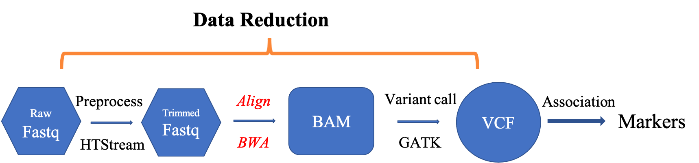
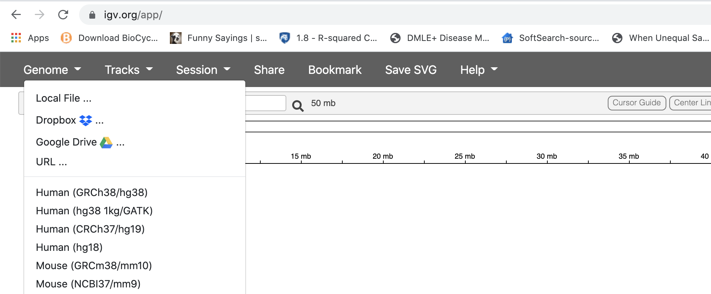
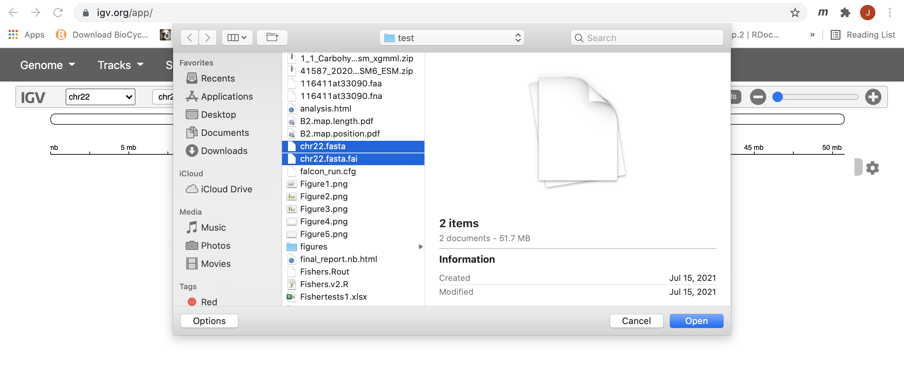
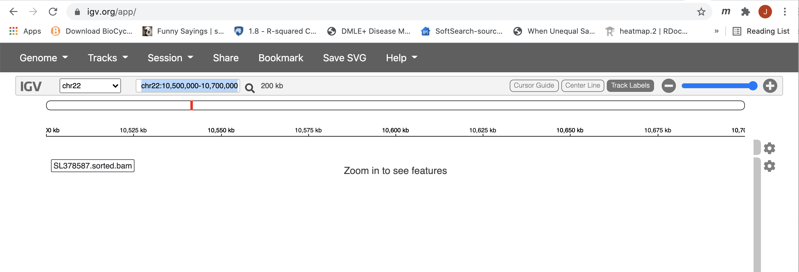
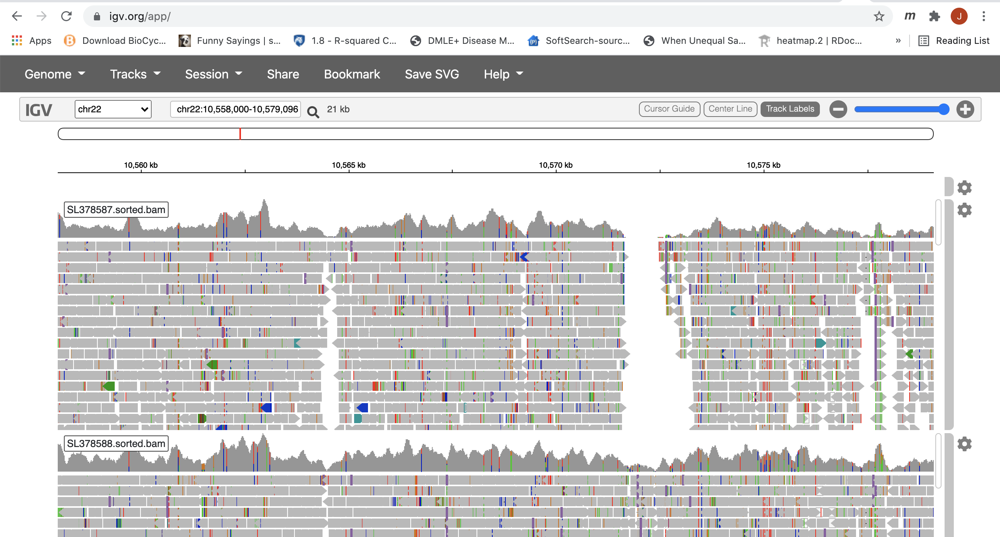

## Alignment of High-Throughput Sequencing Data using BWA
-------------------------------------------------------

In this section, we will use BWA (Burrows-Wheeler Aligner) to align all of our trimmed reads to the reference genome. Then, we will visualize the alignments using IGV.

---

1. Aligning/Mapping vs Assembly
1. Aligners/Mappers
1. Alignments
1. Quality Assurance - Mapping statistics as QA/QC.

## Mapping vs Assembly

**Assembly** seeks to put together the puzzle without knowing what the picture is.

- The focus is on the pieces, how they fit together.

**Mapping** (or alignment to a reference) tries to put together the puzzle pieces directly onto an image of the picture.
- The focus is on the puzzle, regions of the puzzle that contain certain characteristics (ex. what background) that will help you place the piece onto the puzzle.
- In mapping the question is more, given a small chunk of sequence, where in the genome did this sequence most likely come from.
- The goal then is to find the match(es) with either the “best” edit distance (smallest difference), or all matches with edit distance less than max edit distance. Main issues are:
* Large search space
* Regions of similarity (aka repeats)
* Gaps (INDELS)
* Complexity (RNA, splicing, transcripts)

### Alignment concepts

* Multimappers:
  * Reads that align equally well to more than one reference location.
  * Generally, multimappers are discounted in variant detection, and are often discounted in counting applications (like RNA-Seq ... would “cancel” out anyway).
  * Note: multimapper “rescue” in some algorithms (RSEM, Express?).
* Duplicates:
  * Reads or read pairs arising from the same original library fragment, during library preparation (PCR duplicates).
  * Generally, duplicates can only be detected reliably with paired-end sequencing. If PE, they’re discounted in variant detection, and discounted in counting applications (like RNA-Seq).
* Clipping vs Splicing
  * soft-clipped: bases in 5' and 3' of the read are NOT part of the alignment.
  * hard-clipped: bases in 5' and 3' of the read are NOT part of the alignment AND those bases have been
  removed from the read sequence in the BAM file. The 'real' sequence length would be length(SEQ)+ count-of-hard-clipped-bases
  * [From biostars](https://www.biostars.org/p/119537/)

* Inner length, insert size, fragment length

*From [This Biostars answer](https://www.biostars.org/p/106291/)*

#### Considerations when mapping
* Placing reads in regions that do not exist in the reference genome (reads extend off the end of linearized fragments) [ mitochondrial, plasmids, structural variants, etc.].
* Sequencing errors and genetic variation: alignment between read and true source in genome may have more differences than alignment with some other copy of repeat.
* What if the closest fully sequenced genome is too divergent?
* Placing reads in repetitive regions: Some algorithms only return 1 mapping; If multiple: map quality = 0
* Algorithms that use paired-end information => might prefer correct distance over correct alignment.

---
## Aligners/Mappers
Many [alignment algorithms](https://en.wikipedia.org/wiki/List_of_sequence_alignment_software
) to choose from. Examples include:
* Aligners that can ’clip’
  * bwa-mem
  * Bowtie2 in local mode
* Spliced Aligners
  * STAR
  * HiSAT2 (formerly Tophat [Bowtie2])
  * GMAP/GSNAP
  * SOAPsplice
  * MapSplice

---

## Alignments

### Reference genome

Genome sequence fasta file should be identified at the beginning of the analysis.

* Genome fasta files should include all chromosomes, unplaced sequences and un-localized sequences, as well as any organelles: primary assembly.

* Should contain any contigs that represent patches.

* Pseudoautosomal regions masked.

* For variant calling purpose, a decoy sequence set could be added to improve mapping quality. The decoy sequences contain known true human sequences that are not in the reference genome. It will help to reduce the number of reads that would otherwise map with low quality in the reference. 

* Alternative haplotype contigs should not be included in the reference, unless a ALT-aware mapper is used.

[here](https://ftp.ncbi.nlm.nih.gov/genomes/all/GCA/000/001/405/GCA_000001405.28_GRCh38.p13/GRCh38_major_release_seqs_for_alignment_pipelines/) is where one can find the proper version of human reference genome.

---

#### Indexing the reference

In this workshop, we are going to only use human chr22 as the reference and do not worry about the unplace, un-localized, alt or decoy sequences. This also reduces the size of our dataset so that the steps will finish relatively quickly.

####  Start Group Exercise 1: 
- work through the steps to get the reference (chr22) and index it using the command _bwa index_

**1.** First go to your gwas_example directory and make sure that a direcoty called "References" is created

    cd /share/workshop/gwas_workshop/$USER/gwas_example  
    mkdir -p References  
    cd References  

Link to the chr22.fa file that I created:

    ln -s /share/workshop/gwas_workshop/jli/gwas_example/References/chr22.fa .
    ls -lh

**2.** Once we have the reference genome, the first thing to do is to index it for the mapper/aligner

    cd /share/workshop/gwas_workshop/$USER/gwas_example/References
    module load bwa

Index the reference:

    bwa index chr22.fa

**Questions:**
- How many new files were created by _bwa index_ command?

####  Stop Group Exercise 1: 

---

### Carry out alignment

####  Start Group Exercise 2: 
- work through getting the help manual for _bwa mem_ command
- carry out mapping step using _bwa mem_ command and see whether you can understand the parameters used

**1.** Now, we are going to go through the alignment steps for one sample (SL378587). We will create a test directory for this purpose.

    cd /share/workshop/gwas_workshop/$USER/gwas_example
    mkdir -p BWA_testing
    cd BWA_testing

We will be using the 'mem' algorithm under BWA to carry out the alignments. First, let's take a look at the help manual:

    bwa mem --help
    
Note that the Usage shows that we need to give bwa a location for the 'idxbase', which is the path to the reference. Now, we will align the two paired-end files and redirect the alignment output (in SAM format) to a file. We will use 2 threads (processors) and add read group (i.e sample ID) information to the alignment:

    bwa mem -t 2 -M -R "@RG\tID:SL378587\tSM:SL378587" ../References/chr22.fa ../01-HTS_Preproc/SL378587/SL378587.htstream_R1.fastq.gz ../01-HTS_Preproc/SL378587/SL378587.htstream_R2.fastq.gz > SL378587.sam

This step will take a minute to run. The output of the alignment has been saved to a sam file, which is a text file format. It can be looked at by using any text editor. Please use _nano_ to look at the file and see whether you recognize any information included in it. We will come back together and talk about the sam file format in detail in the main room.

**Questions:**
- What does the parameter "-t" do?
- What does the parameter "-R" do?

####  Stop Group Exercise 2: 

---

####  Start Group Exercise 3: 

**2\.** Then, we need to convert the sam files into bam files for downstream processing. We will use a tool called 'samtools' to do this. Load the samtools module and take a look at the various subcommands and options:

    module load samtools
    samtools
    samtools view

We will use 'samtools view' to convert the sam files into a bam files (binary sam)... using 2 threads and the '-b' flag to output bam format:

    samtools view -@ 2 -b -o SL378587.bam SL378587.sam

Sort the alignment for indexing:

    samtools sort -@ 2 -o SL378587.sorted.bam SL378587.bam

---

**3\.** Index the final alignment file. This will allow downstream programs to easily read data from the bam file:

    samtools index SL378587.sorted.bam

You can also use 'samtools flagstat' to get a summary of the alignment:

    samtools flagstat SL378587.sorted.bam

30482 + 0 in total (QC-passed reads + QC-failed reads)
152 + 0 secondary
0 + 0 supplementary
0 + 0 duplicates
30482 + 0 mapped (100.00% : N/A)
30330 + 0 paired in sequencing
15165 + 0 read1
15165 + 0 read2
30240 + 0 properly paired (99.70% : N/A)
30330 + 0 with itself and mate mapped
0 + 0 singletons (0.00% : N/A)
0 + 0 with mate mapped to a different chr
0 + 0 with mate mapped to a different chr (mapQ>=5)

**Questions:**
- What does _samtools view_ do?
- What does _samtools sort_ do?
- What does _samtools flagstat_ do?

####  Stop Group Exercise 3: 

---

####  Stop Group Exercise 4: 
- work through running alignment for all samples using the slurm script
- work through visualizing the alignment using IGV

**4\.** In the next step, we will use another Slurm script to run all the alignment commands on all of the samples. First download the script:

    wget https://ucdavis-bioinformatics-training.github.io/2021-July-Genome-Wide-Association-Studies/software_scripts/scripts/bwa.slurm

Take a look at it and understand what it's doing:

    cat bwa.slurm

#!/bin/bash

#SBATCH --nodes=1
#SBATCH --ntasks=8
#SBATCH --time=60:00
#SBATCH --mem=4000 # Memory pool for all cores (see also --mem-per-cpu)
#SBATCH --partition=production
#SBATCH --array=1-3
#SBATCH --output=slurmout/bwa_%A_%a.out # File to which STDOUT will be written
#SBATCH --error=slurmout/bwa_%A_%a.err # File to which STDERR will be written

start=`date +%s`
echo $HOSTNAME
echo "My SLURM_ARRAY_TASK_ID: " $SLURM_ARRAY_TASK_ID
aklog

sample=`sed "${SLURM_ARRAY_TASK_ID}q;d" samples.txt`
echo "SAMPLE: ${sample}"

outpath="/share/workshop/gwas_workshop/$USER/gwas_example/03-BWA"
echo "OUTPUT DIR: ${outpath}"
[[ -d ${outpath} ]] || mkdir -p ${outpath}
[[ -d ${outpath}/${sample} ]] || mkdir -p ${outpath}/${sample}

module load bwa
module load samtools

call="bwa mem -t 4 -R '@RG\tID:'${sample}'\tSM:'${sample} -M References/chr22.fa \
	01-HTS_Preproc/${sample}/${sample}.htstream_R1.fastq.gz \
	01-HTS_Preproc/${sample}/${sample}.htstream_R2.fastq.gz | \
	samtools view -bh -@ 2 -m 3G - | \
	samtools sort -@ 2 -m 3G -O bam -o ${outpath}/${sample}/${sample}.sorted.bam - "

echo $call
#eval $call

call="samtools flagstat ${outpath}/${sample}/${sample}.sorted.bam > ${outpath}/${sample}/${sample}_flagstat.log"

echo $call
eval $call

end=`date +%s`
runtime=$((end-start))
echo $runtime

Once we have understood what the script is doing, we can submit it to the cluster for computing:

    sbatch -J bwa.${USER} bwa.slurm

This should take less than 10 minutes to run. Use 'squeue' to check on your processes:

    squeue -u $USER

---

**5\.** Once this is done, let's take a look at the alignments using IGV. In order to do that, you will have to download the reference and alignment files to our local machine.

First, we have to index the fasta file for IGV. The following command accomplish that.

    cd /share/workshop/gwas_workshop/$USER/gwas_example/References
    samtools faidx chr22.fa

Now we need to transfer the reference fasta, together with its index file and the bam files to our local computer.

**For those who use Mac, a linux machine or Windows Power Shell, you may open a new terminal windown and use the following scp command to download the files. Do remember to change the _user.name_ to your user name on tadpole.**

    scp user.name@tadpole.genomecenter.ucdavis.edu:/share/workshop/gwas_workshop/$USER/gwas_example/References/chr22.fa .
    scp user.name@tadpole.genomecenter.ucdavis.edu:/share/workshop/gwas_workshop/$USER/gwas_example/References/chr22.fa.fai .
    scp user.name@tadpole.genomecenter.ucdavis.edu:/share/workshop/gwas_workshop/$USER/gwas_example/03-BWA/*/*.sorted.bam* .
    pwd

**For others, you may download [Filezilla](https://filezilla-project.org/), install it and then use it to transfer the files.**

---

**6\.** It is very convenient to use the [IGV Web app](https://igv.org/app/) to visualize the alignment.

IGV should start up automatically. The first thing we want to do is load our reference (chr22.fa). Click on "Genome" in the menu and choose "Local File":

Find your genome file and its index file on your laptop and choose both of the file at the same time:

-----

**7\.** Now let's load all the alignments. This can be done similarly as how we loaded the genome files, but using the "Tracks" tab and choose "Local File". **Note: alignments must be loaded one sample at a time; you must select both the bam file and its index .bai file at the same time for IGV to be able to load the alignment properly.**

After loading all 3 alignments, however, you will not see anything until you zoom in. The data was subsetted to cover the region of 10500000-10700000 on chr22. So, to be able to see anything, we must zoom in to this region first. Please see the screen shot below and the blue highlighted location is where we should specify our region of interest. After entering the correct coordinates, hit enter.

This region is still to large for IGV to display any alignment. Now, you can draw a box along the coordinate labled ruler to zoom in further.

---

**8\.** Now you can see all the alignments. Within each alignment, each colored bar represents a read. Clicking on a specific read will give you a popup with detailed information about that read. The colors (by default) are based on the pair-orientation for paired-end reads. You can change this (and other properties) of the tracks by clicking the setting wheel at the top-right corner of each bam track. For example, choosing "Squished" gives a more compact representation of the alignment. Play around with the various options to see how things change.

####  Stop Group Exercise 4: 

---

**9\.** I would like to introduce a tool: [Qualimap](http://qualimap.conesalab.org/doc_html/index.html), which takes sorted bam files as input and output many metrics that may point to potential problems. Two slurm scripts can be run to produce both single sample summaries, as well as multiple samples report.

    cd /share/workshop/gwas_workshop/$USER/gwas_example
    wget https://ucdavis-bioinformatics-training.github.io/2021-July-Genome-Wide-Association-Studies/software_scripts/scripts/qualimap_single.slurm
    wget https://ucdavis-bioinformatics-training.github.io/2021-July-Genome-Wide-Association-Studies/software_scripts/scripts/qualimap_multi.slurm

Once the jobs are done, we can download the html files and the corresponding images_* directories to our local machine for visualization. [here](multisampleBamQcReport.html) is the multiple sample report I produced.

