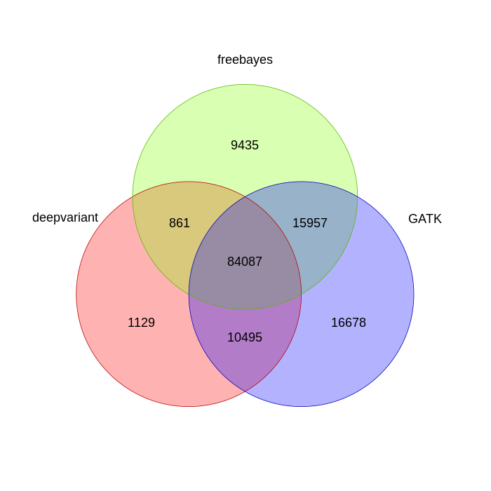

Comparison of freebayes, gatk, and deepvariant outputs
-------------------------------------------------------

freebayes, gatk, and deepvariant were run on the full chr22 dataset. Here is the command for freebayes:

	module load freebayes
	freebayes --bam-list bamlist.txt --fasta-reference ref/chr22.fa --vcf 03-freebayes/fb.ALL.vcf

where bamlist.txt is a file containing the names of the 3 bam files.

Here are the commands for deepvariant:

	module load deepvariant

	singularity exec --nv -B /usr/lib/locale/:/usr/lib/locale/ -H /share/workshop/gwas_workshop/joshi $DEEPVARIANT_IMG_PATH/deepvariant-1.1.0-gpu.simg /opt/deepvariant/bin/run_deepvariant --logging_dir logs --model_type WGS --output_gvcf 03-deepvariant/SL378587.gvcf --output_vcf 03-deepvariant/SL378587.vcf --reads 02-BWA/SL378587/SL378587.pe.bam --ref ref/chr22.fa --num_shards 10

	singularity exec --nv -B /usr/lib/locale/:/usr/lib/locale/ -H /share/workshop/gwas_workshop/joshi $DEEPVARIANT_IMG_PATH/deepvariant-1.1.0-gpu.simg /opt/deepvariant/bin/run_deepvariant --logging_dir 03-deepvariant/SL378588_logs --model_type WGS --output_gvcf 03-deepvariant/SL378588.gvcf --output_vcf 03-deepvariant/SL378588.vcf --reads 02-BWA/SL378588/SL378588.pe.bam --ref ref/chr22.fa --num_shards 10

	singularity exec --nv -B /usr/lib/locale/:/usr/lib/locale/ -H /share/workshop/gwas_workshop/joshi $DEEPVARIANT_IMG_PATH/deepvariant-1.1.0-gpu.simg /opt/deepvariant/bin/run_deepvariant --logging_dir 03-deepvariant/SL378589_logs --model_type WGS --output_gvcf 03-deepvariant/SL378589.gvcf --output_vcf 03-deepvariant/SL378589.vcf --reads 02-BWA/SL378589/SL378589.pe.bam --ref ref/chr22.fa --num_shards 10

Then the three gvcf files were combined into into a single bcf (binary vcf) file using [glnexus_cli](https://github.com/dnanexus-rnd/GLnexus/releases):

	glnexus_cli --config DeepVariantWGS 03-deepvariant/SL37858*.gvcf > 03-deepvariant/deepvariant.ALL.bcf

and finally converting the bcf to vcf:

	module load bcftools
	bcftools view deepvariant.ALL.bcf > deepvariant.ALL.vcf

The gatk commands were the ones from the course.

---

Here are the numbers of variants found per software (after filtering out low quality variants):

freebayes    110340   
GATK         127217   
deepvariant  96581    

Looking at just the variant call positions, here is the venn diagram of shared positions:

