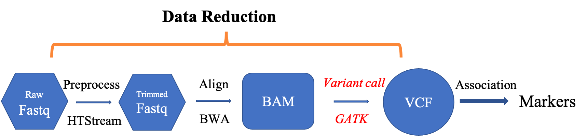
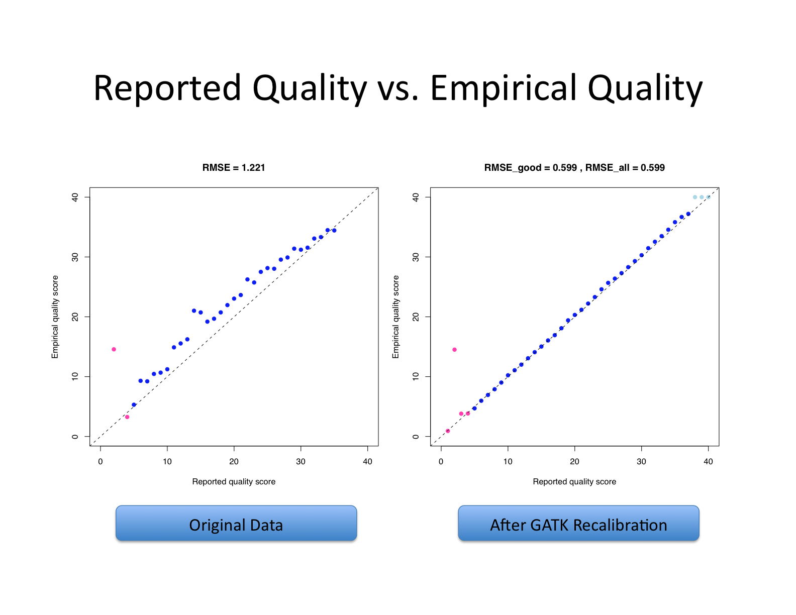
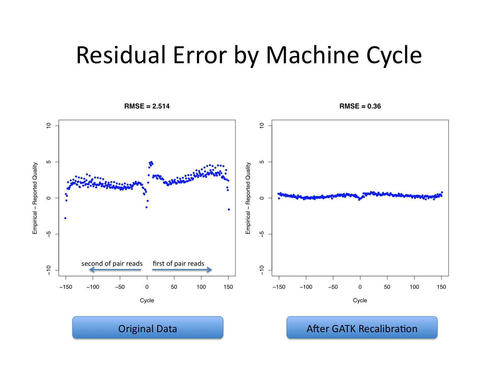
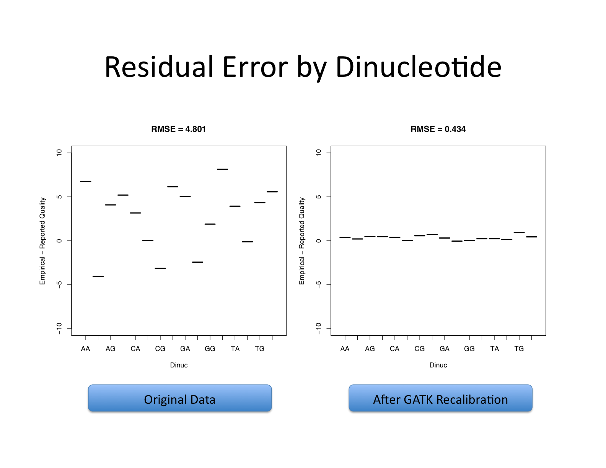
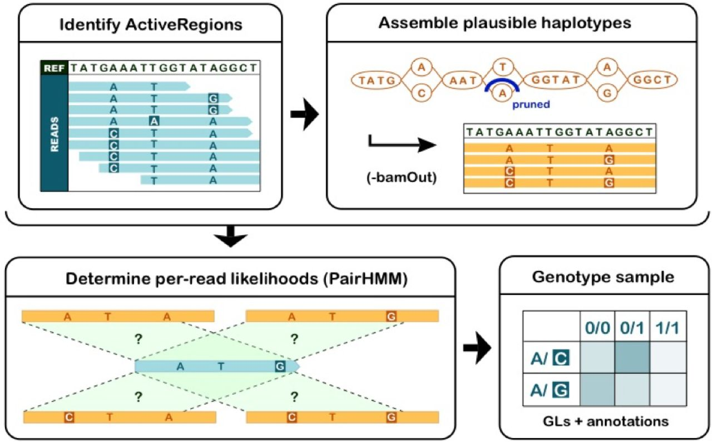
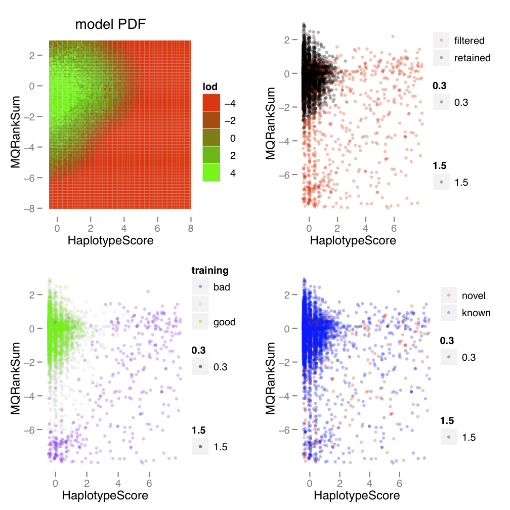
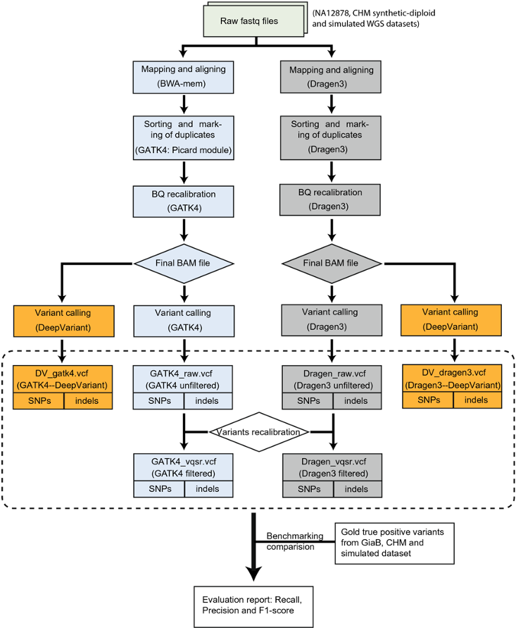
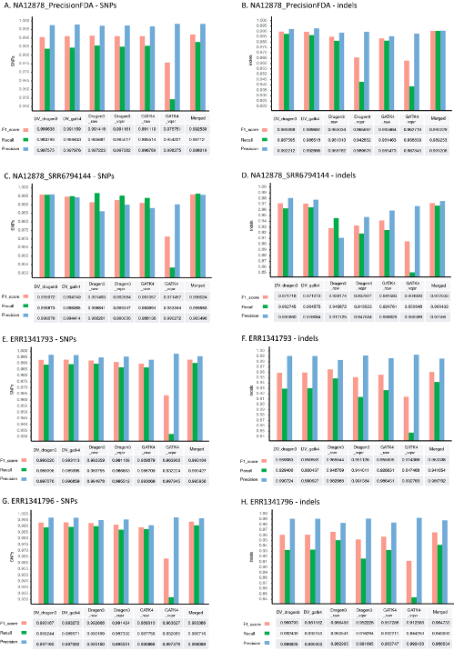
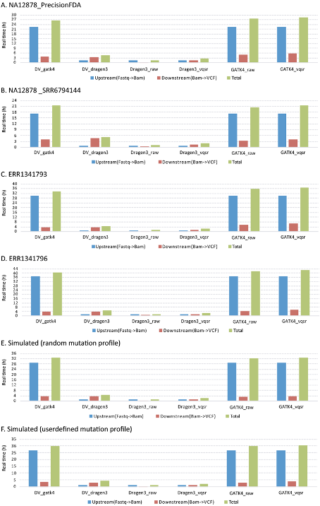

# Variant Discovery using GATK
-------------------------------------------------------

1. Variant analysis tools
1. Using GATK

---

## Variant analysis tools

There are many variant analysis tools available publicly, for different variant types, as well as using different approaches. Variant analysis tools are designed based on what sequencing data is available. Some of them do have modules available for multiple data types, such as DeepVariant. Even when we focus on the short read Illumina data, there are many tools available. Only seleted a few are listed below for demonstration purpose.

* Small/short variants (SNPs + Indels)
  * GATK
  * DeepVariant
  * DRAGEN
  * Freebayes
* Copy number variations
  * GATK
  * CNVnator
* Structure variants
  * GATK (beta)
  * DELLY
  * Lumpy
  
---

## Variant discovery using GATK

In this section, we are going to use GATK to call short variants (SNPs + Indels) using GATK.

https://gatk.broadinstitute.org/hc/en-us/articles/360035535932-Germline-short-variant-discovery-SNPs-Indels-

---

1. Mark duplicates
1. Base quality score recalibration
1. Call variants per-sample
1. Joint-call variants
1. Variant score recalibration

----------------------------------------

### Mark duplicates

This step is optional if you have done deduplication in read preprocessing step, as we have done using hts_SuperDeduper. The steps below serves as a helper if you need it in your own data analysis, where you do not do deduplication in the data preprocessing step. 

    cd /share/workshop/gwas_workshop/$USER/gwas_example  
    wget https://ucdavis-bioinformatics-training.github.io/2021-July-Genome-Wide-Association-Studies/software_scripts/scripts/picard.slurm  

You will have to modify the slurm script to fit your need.

---

### Base quality score recalibration (BQSR)

Let's recall what base quality scores are. They are per-base estimates of error emitted by the sequencing machines. They express how confident the machine was that it called the correct base each time. The algorithm used to calculate the quality scores is a black box to any sequencing customers. The scores produced by the sequencing machines are subject to various sources of systematic technical error, leading to inaccurate base quality scores in the data.

Variant calling algorithms rely heavily on the base quality scores to provide evidence in determining whether a variant observed is the biological truth or just sequencing error. BQSR applies machine learning technique to model these errors empirically and adjust the quality scores accordingly. Several covariates are modeled in an additive way in this process, including mainly sequence context and position in read, or cycle.

The aim of this step is to detect systematic errors made by the sequencer when estimating the quality score of each base call and correct them. More accurate base qualities will in turn improve the accuracy of the variant calls.

https://gatk.broadinstitute.org/hc/en-us/articles/360035890531-Base-Quality-Score-Recalibration-BQSR-

This step involves two operations: first is to model the base quality scores and calculate the necessary correction (BaseRecalibrator); the second is to apply the correction (ApplyBQSR). The script for this step is [gatk_bqsr.slurm](https://ucdavis-bioinformatics-training.github.io/2021-July-Genome-Wide-Association-Studies/software_scripts/scripts/gatk_bqsr.slurm).

#####  Start Group Exercise 1: 
- work through the steps to link to the resources vcf files and their index files
- work through getting the script gatk_bqsr.slurm and run it

First, we have to download a few vcf files from [GATK google cloud space](https://console.cloud.google.com/storage/browser/genomics-public-data/resources/broad/hg38/v0;tab=objects?pli=1&prefix=&forceOnObjectsSortingFiltering=false). These will be used for training the machine learning processes necessary during the variant discorey. We are not going to actually download any of them, as some of them will take a long time to download. I have downloaded them and you can create soft links to them for this workshop.

    cd /share/workshop/gwas_workshop/$USER/gwas_example/References
    ln -s /share/workshop/gwas_workshop/jli/gwas_example/References/1000G_omni2.5.hg38.vcf* .
    ln -s /share/workshop/gwas_workshop/jli/gwas_example/References/1000G_phase1.snps.high_confidence.hg38.vcf* .
    ln -s /share/workshop/gwas_workshop/jli/gwas_example/References/hapmap_3.3.hg38.vcf* .
    ln -s /share/workshop/gwas_workshop/jli/gwas_example/References/Homo_sapiens_assembly38.dbsnp138.vcf* .
    ln -s /share/workshop/gwas_workshop/jli/gwas_example/References/Mills_and_1000G_gold_standard.indels.hg38.vcf* .

These files are very valuable resources for GATK analysis for human. They include known sites, training sets and truth sets. 

**Know sites** is a list of variants that have been previously identified and reported, such as dbSNP. This list typically does not imply any level of systematic curation or cross-validation. Tools that take these data as input do not assume that the variant calls in the list are all true. One could _bootstrap_ a list of known sites by a first round of variant calling without BQSR or VQSR.

**Training sets** is a list of variants that is used by machine learning algoriths to model the properties of true variation vs. artifacts. This requires a higher standard of curation and validation. Tools take this data as input typically accept a parameter that indicates your degree of confidence in the resource. This set is difficult to bootstrap, as it benefits greatly from orthogonal valication.

**Truth sets** is a list of variants that is used to evaluate the quality of a variant callset (eg. sensitivity and specificity, or recall). This requires the highest standard of validation. Tools take this data as input assume that all variants in the set are true variation. This set cannot be bootstrapped and must be generated using orthogonal validation methods.

Now, let's get the script for base quality score recalibration, look at it to understand what it does and run it.

    cd /share/workshop/gwas_workshop/$USER/gwas_example
    wget https://ucdavis-bioinformatics-training.github.io/2021-July-Genome-Wide-Association-Studies/software_scripts/scripts/gatk_bqsr.slurm
    cat gatk_bqsr.slurm
    sbatch -J bqsr.${USER} gatk_bqsr.slurm

#####  Stop Group Exercise 1: 

**The base quality recalibration works better when the number of mapped bases are large enough and will not work well on a small number of aligned reads. 1B bases produces significantly better results.**

---

### Calling variants (HaplotypeCaller)

https://gatk.broadinstitute.org/hc/en-us/articles/360035531412-HaplotypeCaller-in-a-nutshell

Four steps involved in this process:

  * Define active regions
    Travers the sequencing data to identify regions that show variation beyond the expected background noise. These active regions are passed to the next step for analysis.
  * Determine haplotypes by local assembly of the active region
    Construct the complete sequences covering the entire length of a actove region using a local assembly, which is called haplotypes. This process typically generate several different possible haplotypes for each active region. These haplotypes are realigned to the reference to identify potential variant sites.
  * Evaluating the evidence for haplotypes and variant alleles
    This step takes into account the quality of the data (the base quality scores and indel quality scores). A score is produced to express the likelihood of observing a read from a haplotype.
  * Assigning per-sample genotypes
    Using the likelihood scores calculated in the previous step and Bayes' theorem to calculate the likelihoods of each possible genotype. The degree of confidene in a genotype depends on both the quality and the quantity of the available data. Low coverage and low quality will both lead to lower confidence calls. Only the reads that safisfy certain mapping quality thresholds and the bases that satisfy certain base quality thresholds will be used: 20.

HaplotypeCalled can be used to call variants for a single-sample GVCF-based calling or multisample calling. GVCF-based calling is a very efficient way of calling variants for many samples, or when the data set is expected to grow over time. Here we are going to go through the GVCF-based calling for each sample first, followed by joint genotyping for all samples. The rationale behind joint genotyping is to leverage population-wide information from a cohort of multiple samples. It allows us to detect variants with great sensitivity and genotype samples as accurately as possible.

#####  Start Group Exercise 2: 
- work through running gatk_hc.slurm and gatk_genotyping.slurm

Now, let's carry out the variant calling using HaplotypeCaller and GVCF-based per-sample calling.

    cd /share/workshop/gwas_workshop/$USER/gwas_example
    wget https://ucdavis-bioinformatics-training.github.io/2021-July-Genome-Wide-Association-Studies/software_scripts/scripts/gatk_hc.slurm  
    cat gatk_hc.slurm
    sbatch -J hc.${USER} gatk_hc.slurm

Then, we collect variation information encoded in each GVCF file for all samples and carry out joint genotyping.

    cd /share/workshop/gwas_workshop/$USER/gwas_example
    wget https://ucdavis-bioinformatics-training.github.io/2021-July-Genome-Wide-Association-Studies/software_scripts/scripts/gatk_genotyping.slurm  
    cat gatk_genotyping.slurm
    sbatch -J gt.${USER} gatk_genotyping.slurm

The filnal result is a file called _trio.vcf.gz_ and its index inside the directory 04-GATK.

#####  Stop Group Exercise 2: 

---

### Filter variants

Variant callsets must be filtered before any downstream analysis. There are two ways to do the filtering: one is hard-filtering using user defined parameters using the annotation of the variants; the second is to use Variant Quality Score Recalibration (VQSR). VQSR is recommended by GATK team. It uses machine learning techniques to learn from each dataset what is the annotation profile of good variants vs. bad variants. It uses multiple profile information to do the learning and allows us to pick out clusters of variants in a different way than using hard thresholding for any annotation.

https://gatk.broadinstitute.org/hc/en-us/articles/360035531612-Variant-Quality-Score-Recalibration-VQSR-

The Variant Quality Score Recalibration is accomplished by two commands in GATK: _VariantRecalibrator_ that builds the model and _ApplyVQSR_ to apply the learned filters. Because SNPs and Indels have different profiles, they must be filtered separately.

#!/bin/bash

#SBATCH --nodes=1
#SBATCH --ntasks=2
#SBATCH --time=60:00
#SBATCH --mem=4000 # Memory pool for all cores (see also --mem-per-cpu)
#SBATCH --partition=production
#SBATCH --output=slurmout/vqsr_%A_%a.out # File to which STDOUT will be written
#SBATCH --error=slurmout/vqsr_%A_%a.err # File to which STDERR will be written

start=`date +%s`
echo $HOSTNAME
aklog

outpath="/share/workshop/gwas_workshop/$USER/gwas_example/04-GATK"
echo "OUTPUT DIR: ${outpath}"
[[ -d ${outpath} ]] || mkdir -p ${outpath}

module load gatk
module load samtools

# SNPs
call="gatk --java-options '-Xmx4g -Xmx4g' VariantRecalibrator \
	-R References/chr22.fa \
	-V ${outpath}/trio.vcf.gz \
	--trust-all-polymorphic \
	-tranche 100.0 -tranche 99.95 -tranche 99.9 \
	--resource:hapmap,known=false,training=true,truth=true,prior=15.0 References/hapmap_3.3.hg38.vcf \
	--resource:omni,known=false,training=true,truth=false,prior=12.0 References/1000G_omni2.5.hg38.vcf \
	--resource:1000G,known=false,training=true,truth=false,prior=10.0 References/1000G_phase1.snps.high_confidence.hg38.vcf \
	--resource:dbsnp,known=true,training=false,truth=false,prior=2.0 References/Homo_sapiens_assembly38.dbsnp138.vcf \
	-an QD -an MQRankSum -an ReadPosRankSum -an FS -an MQ -an SOR -an DP \
	-mode SNP \
	--max-gaussians 4 \
	-O ${outpath}/trio.snp.recal \
	--tranches-file ${outpath}/trio.snp.tranches \
	--rscript-file ${outpath}/trio.snp.plots.R"

echo $call
eval $call

call="gatk --java-options '-Xmx4g' ApplyVQSR \
	-R References/chr22.fa \
	-V ${outpath}/trio.vcf.gz \
	-O ${outpath}/trio.snp.recal.vcf.gz \
	--truth-sensitivity-filter-level 99.9 \
	--tranches-file ${outpath}/trio.snp.tranches \
	--recal-file ${outpath}/trio.snp.recal \
	-mode SNP"

echo $call
eval $call

# Indels
call="gatk --java-options '-Xmx4g -Xmx4g' VariantRecalibrator \
	-R References/chr22.fa \
	-V ${outpath}/trio.vcf.gz \
	--trust-all-polymorphic \
	-tranche 100.0 -tranche 99.95 -tranche 99.9 \
	--resource:mills,known=false,training=true,truth=true,prior=12 References/Mills_and_1000G_gold_standard.indels.hg38.vcf \
	--resource:axiomPoly,known=false,training=true,truth=false,prior=10 References/Axiom_Exome_Plus.genotypes.all_populations.poly.hg38.vcf \
	--resource:dbsnp,known=true,training=false,truth=false,prior=2 References/Homo_sapiens_assembly38.dbsnp138.vcf \
	-an FS -an ReadPosRankSum -an MQRankSum -an QD -an SOR -an DP \
	--max-gaussians 4 \
	-mode INDEL \
	-O ${outpath}/trio.indel.recal \
	--tranches-file ${outpath}/trio.indel.tranches \
	--rscript-file ${outpath}/trio.indel.plots.R"

echo $call
eval $call

call="gatk --java-options '-Xmx4g' ApplyVQSR \
	-R References/chr22.fa \
	-V ${outpath}/trio.vcf.gz \
	-O ${outpath}/trio.indel.recal.vcf.gz \
	--truth-sensitivity-filter-level 99.9 \
	--tranches-file ${outpath}/trio.indel.tranches \
	--recal-file ${outpath}/trio.indel.recal \
	-mode INDEL"

echo $call
eval $call

end=`date +%s`
runtime=$((end-start))
echo $runtime

---

As for all machine learning techniques, large dataset is required to achieve good performance. Unfortunately, our dataset is too small for this process, so we are going to use the hard filtering approach. The parameters used for the hard filtering are the ones recommended by GATK. As mentioned before, SNPs and Indels will have different filtering parameters.

#!/bin/bash

#SBATCH --nodes=1
#SBATCH --ntasks=2
#SBATCH --time=60:00
#SBATCH --mem=4000 # Memory pool for all cores (see also --mem-per-cpu)
#SBATCH --partition=production
#SBATCH --reservation=workshop
#SBATCH --account=workshop
#SBATCH --output=slurmout/vf_%A_%a.out # File to which STDOUT will be written
#SBATCH --error=slurmout/vf_%A_%a.err # File to which STDERR will be written

start=`date +%s`
echo $HOSTNAME
aklog

outpath="/share/workshop/gwas_workshop/$USER/gwas_example/04-GATK"
echo "OUTPUT DIR: ${outpath}"
[[ -d ${outpath} ]] || mkdir -p ${outpath}

module load gatk
module load samtools

# SNP

call="gatk --java-options '-Xmx4g -Xms4g' SelectVariants \
	-V ${outpath}/trio.vcf.gz \
	-select-type SNP \
	-O ${outpath}/trio.snps.vcf.gz"

echo $call
eval $call

call="gatk --java-options '-Xmx4g -Xmx4g' VariantFiltration \
	-R References/chr22.fa \
	-V ${outpath}/trio.snps.vcf.gz \
	-O ${outpath}/trio.filtered.snps.vcf.gz \
	--filter-name 'filter_QD2' \
	--filter-expression 'QD < 2.0' \
	--filter-name 'filter_QUAL30' \
	--filter-expression 'QUAL < 30.0' \
	--filter-name 'filter_FS60' \
	--filter-expression 'FS > 60.0' \
	--filter-name 'filter_SOR3' \
	--filter-expression 'SOR > 3.0' \
	--filter-name 'filter_MQ40' \
	--filter-expression 'MQ < 40.0' \
	--filter-name 'filter_MQRankSum-12.5' \
	--filter-expression 'MQRankSum < -12.5' \
	--filter-name 'filter_ReadPosRankSum-8' \
	--filter-expression 'ReadPosRankSum < -8.0'"

echo $call
eval $call

# Indels

call="gatk --java-options '-Xmx4g -Xms4g' SelectVariants \
	-V ${outpath}/trio.vcf.gz \
	-select-type INDEL \
	-O ${outpath}/trio.indels.vcf.gz"

echo $call
eval $call

call="gatk --java-options '-Xmx4g -Xmx4g' VariantFiltration \
	-R References/chr22.fa \
	-V ${outpath}/trio.indels.vcf.gz \
	-O ${outpath}/trio.filtered.indels.vcf.gz \
	--filter-name 'filter_QD2' \
	--filter-expression 'QD > 2.0' \
	--filter-name 'filter_QUAL30' \
	--filter-expression 'QUAL < 30.0' \
	--filter-name 'filter_FS200' \
	--filter-expression 'FS > 200.0' \
	--filter-name 'filter_ReadPosRankSum-20' \
	--filter-expression 'ReadPosRankSum < -20.0'"

echo $call
eval $call

end=`date +%s`
runtime=$((end-start))
echo $runtime

#####  Start Group Exercise 3: 
- work through running gatk_filter.slurm

Now we are going to run this step to filter our VCF calls.

    cd /share/workshop/gwas_workshop/$USER/gwas_example
    wget https://ucdavis-bioinformatics-training.github.io/2021-July-Genome-Wide-Association-Studies/software_scripts/scripts/gatk_filter.slurm  
    sbatch -J ft.${USER} gatk_filter.slurm

Use zless to look at the outputs generated by this filter step.

#####  Stop Group Exercise 3: 

---

#####  Start Group Exercise 4: 

We can merge the filtered VCF files for SNPs and Indels together as the final result.

    cd /share/workshop/gwas_workshop/$USER/gwas_example
    wget https://ucdavis-bioinformatics-training.github.io/2021-July-Genome-Wide-Association-Studies/software_scripts/scripts/gatk_merge.slurm -O gatk_merge.slurm
    sbatch -J merge.${USER} gatk_merge.slurm

The above commands generate the merged variants in _trio.filtered.all.vcf.gz_ file and its index. IGV can used used to visualize this file. First, download the file to your laptop/desktop. Then open IGV web app as we did to visualize the alignment. Load the reference genome as before, and load the downloaded vcf file by **Tracks**->**Local File**. Choose the vcf file and its index and click open. Zoom to the region (chr22:10500000-10700000) to see variants.

#####  Stop Group Exercise 4: 

---

## Compare variant callers

https://www.nature.com/articles/s41598-020-77218-4

## Larger dataset for practice

We have created a dataset for the full chromosome chr22. They are located in /share/biocore/workshops/GWAS/00-RawData/. You can link them to your directory and run the full workflow that we have talked about, from data preprocessing to variant calling.

